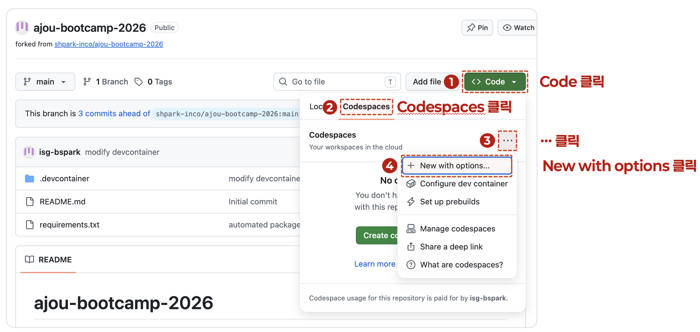

# 오믹스 · AI 에이전트 실습 환경

GitHub Codespaces 에서 클릭 몇 번으로 실습 환경이 그대로 열리도록 구성한 저장소입니다.
설치 과정 없이 바로 시작할 수 있습니다.

| 교시 | 무엇을 하나 | 안내서 |
| --- | --- | --- |
| **2일차 1교시** | MCP 로 도구를 붙이고 고치고, SKILL 로 일하는 방식을 코드 자산으로 만들어 배포 | [README_agentlab.md](README_agentlab.md) |
| **2일차 2교시** | 실제 single-cell RNA-seq 데이터로 QC 부터 기능 분석까지, 병렬 실험으로 비교 | [README_omicslab.md](README_omicslab.md) |

## 환경 설정

### 1. 저장소를 내 계정으로 fork

저장소 오른쪽 위 **Fork ▸ Create fork** 를 눌러 **내 계정으로 사본**을 만듭니다.

실습 중에 파일을 고치고 커밋하게 되므로 원본이 아니라 내 사본에서 작업해야 합니다.
1교시 5단계(스킬을 GitHub 에 배포)도 내 계정이 있어야 진행됩니다.

fork 가 끝나면 주소가 `github.com/<내ID>/...` 로 바뀝니다.
**아래 과정은 전부 이 fork 한 저장소에서 합니다.**

### 2. Codespace 만들기

fork 한 저장소에서 **Code ▸ Codespaces ▸ ··· ▸ New with options…** 로 들어갑니다.



초록색 **Create codespace** 버튼을 바로 누르지 않고 **New with options…** 로 가는 이유는,
이 경로에서만 **Anthropic 인증 키를 함께 넣을 수 있기** 때문입니다. 열린 화면에서
브랜치가 `main` 인지 확인하고 아래 둘 중 **하나**를 채운 뒤 **Create codespace** 를 누릅니다.

| 넣을 것                   | 언제                                                                |
| ------------------------- | ------------------------------------------------------------------- |
| `ANTHROPIC_API_KEY`       | [Anthropic Console](https://platform.claude.com/settings/keys) 에서 발급한 API Key (종량제 과금) |
| `CLAUDE_CODE_OAUTH_TOKEN` | Pro/Max 구독으로 쓸 때. 로컬에서 `claude setup-token` 으로 발급      |

> 둘 다 넣으면 `ANTHROPIC_API_KEY` 가 우선합니다. 지금 비워 두고 만들어도 Codespace 는
> 뜨지만, 나중에 터미널에서 `claude` 로 직접 로그인해야 합니다.

### 3. 설치가 끝나면 점검

컨테이너가 만들어지고 패키지가 설치될 때까지 기다립니다 (최초 1회, 10~15분).
터미널에 `✅ 환경 준비 완료` 가 뜨면 아래로 점검합니다.

```bash
python3 agent_lab/verify.py    # 1교시 — MCP · SKILL 실습 환경
python3 tools/verify.py        # 2교시 — 패키지 · gene set 캐시 · 입력 데이터
```

VS Code 화면은 어두운 테마(Default Dark Modern)로 설정되어 있고,
**Claude Code 확장**이 미리 설치되어 있어 사이드바에서 바로 사용할 수 있습니다.
터미널에서 `claude` 명령으로도 실행됩니다.

Claude Code 용 프로젝트 지침은 `cp CLAUDE.example.md CLAUDE.md` 로 만들어 씁니다.

### 설치되는 주요 패키지

`scanpy` `anndata` `leidenalg` `igraph` `umap-learn` `harmonypy` `pydeseq2` `decoupler`
`gseapy` `celltypist` `matplotlib` `seaborn` `jupyterlab`

전체 목록과 버전은 [.devcontainer/requirements.txt](.devcontainer/requirements.txt) 참고.

## 저장소 구조

```
README_agentlab.md      2일차 1교시 안내서 (MCP · SKILL)
README_omicslab.md      2일차 2교시 안내서 (scRNA-seq 분석)
CLAUDE.example.md       Claude Code 용 프로젝트 지침 — cp CLAUDE.example.md CLAUDE.md

agent_lab/              1교시 실습 재료 — MCP 서버·점검 스크립트·정답 코드
.mcp.json               MCP 서버 등록 파일 — 1교시에서 직접 채웁니다
docs/images/            README 에 쓰는 화면 캡처

data/raw/               GEO 원본 파일 (mtx, barcodes, genes, 세포 주석)
data/genesets/          기능 분석용 gene set · footprint 캐시 (저장소에 함께 들어 있습니다)
data/processed/         전처리된 실습용 h5ad
scripts/prepare_data.py 원본 데이터 → 실습용 데이터 변환 스크립트
data/core_markers.xlsx  celltype 별 핵심 marker 참조 — annotation 검증용

.claude/skills/         분석 스킬 (scrnaseq-plan-execute 등)
.claude/agents/         step-validator — 단계별 채점 서브에이전트
.claude/scripts/        worktree_init.sh — 실험 worktree 세팅 (스킬이 부릅니다)

tools/                  실습 중 직접 열 일이 거의 없는 보조 스크립트
  verify.py             환경 점검 (패키지 · gene set 캐시 · 입력 데이터)
  setup.sh              실험 worktree 를 이름 목록으로 여러 개 미리 생성
  status.sh             병렬 실험 진행 상황 표
  cleanup.sh            worktree 정리
  metrics_template.json 실험 요약용 metrics.json 스키마
  link_shared.py        worktree 에 공용 경로를 심볼릭 링크로 거는 도우미
worktrees/              병렬 실험용 worktree — 스킬이 알아서 만듭니다 (git 추적 안 함)

.devcontainer/
  devcontainer.json     Codespace 정의 (이미지, 확장, 테마, 머신 사양)
  requirements.txt      설치되는 분석 패키지 + MCP 패키지 목록
  tools.txt             uvx 로 미리 받아둘 MCP 서버 목록
  post-create.sh        최초 생성 시 실행되는 설치·점검 스크립트
```
